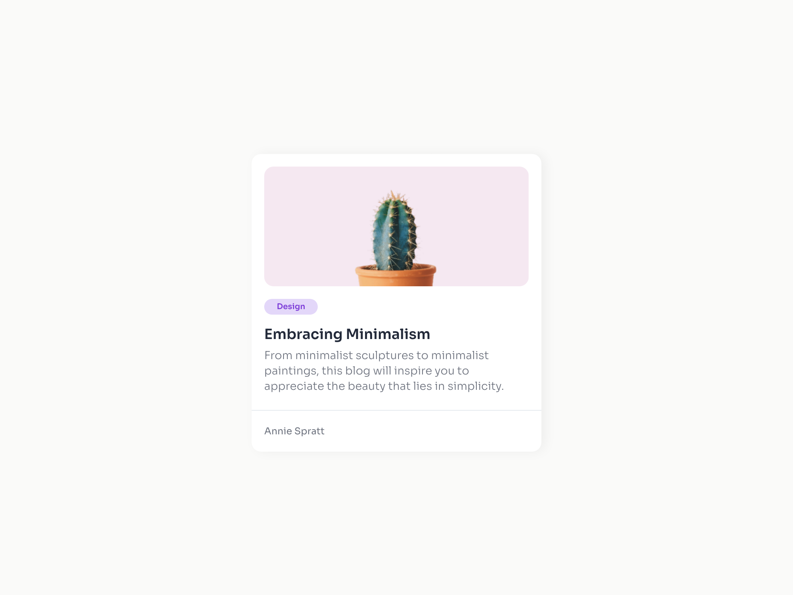

# Minimal Blog Card

This is a solution to the Minimal Blog Card on [devChallenges.io](https://devchallenges.io).

## Table of contents

- [Overview](#overview)
  - [Screenshot](#screenshot)
  - [Links](#links)
- [My process](#my-process)
  - [Built with](#built-with)
  - [What I learned](#what-i-learned)
- [Credits](#credits)

## Overview

### Screenshot

This is a screenshot of the final view of the project.

### Links

- Solution URL: [https://github.com/thejxylog/minimal-blog-card-js](https://github.com/thejxylog/minimal-blog-card-js)
- Live Site URL: [https://minimal-card-js-jayl.netlify.app/](https://minimal-card-js-jayl.netlify.app/)

## My process

### Built with

- Semantic HTML5 markup
- CSS custom properties
- Flexbox

### What I learned

I learned how the consist gap size of the content makes the whole view look organized and clean. I also liked the way how simple variation of its gap can also add more fun to its look.

## Credits

- Challenge site - [devChallenge.io](https://devchallenges.io/challenge/minimal-blog-card)
- Author - [Thu Nghiem](https://devchallenges.io/profile/ff6a2335-b279-4601-8927-85c85af7e7d8)
